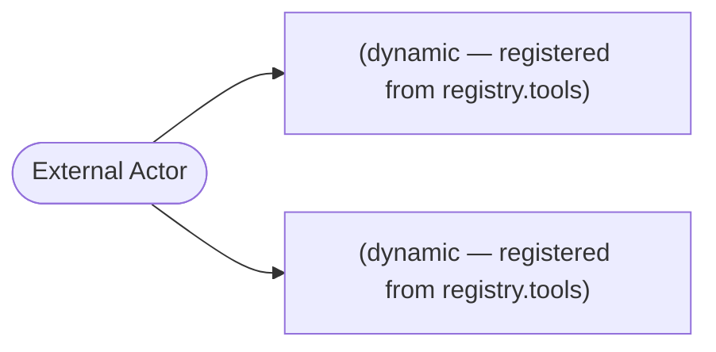

# Data Flow Analysis

## Asset Inventory

### Entry Points

| Kind | Framework | Method | Path / Name | Location |
|------|-----------|--------|-------------|----------|
| mcp_tool | mcp | — | `(dynamic — registered from registry.tools)` | `packages/darnit/src/darnit/server/factory.py:149` |
| mcp_tool | mcp | — | `(dynamic — registered from registry.tools)` | `packages/darnit/src/darnit/server/factory.py:195` |

### Data Stores

No data stores detected.

### Authentication Mechanisms

⚠️ No authentication decorators identified by the structural pipeline. This does NOT mean the application is unauthenticated — it means no recognized decorator pattern was found. Review the entry points above manually.

## Data Flow Diagram

## Attack Chains

No compound attack paths identified.

